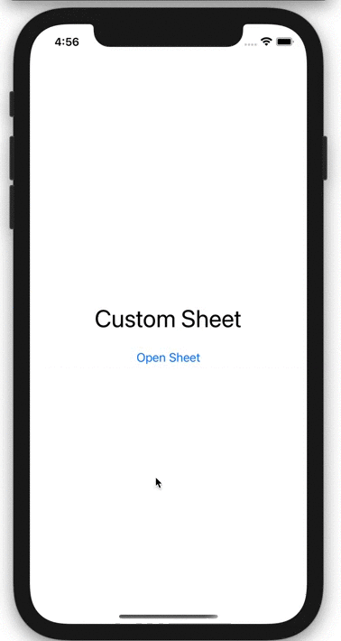
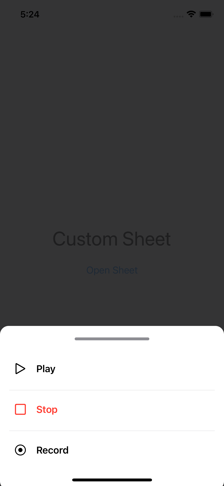
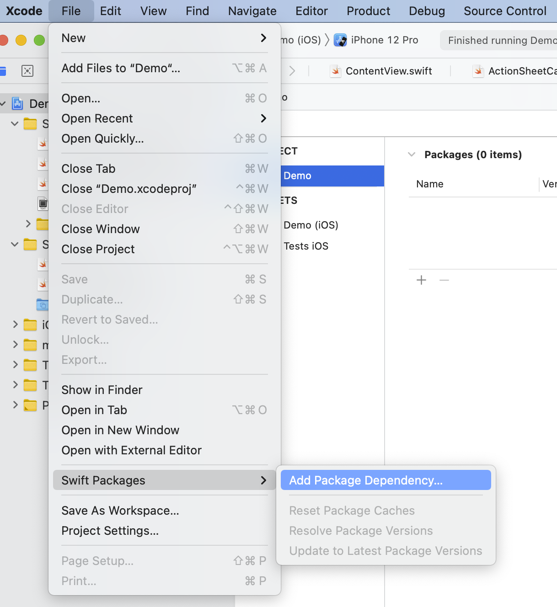

# ActionSheetCard
<p align="center">
    <a href="https://github.com/mahmudahsan/SwiftUI-Action-Sheet-Card">
        
    </a>
    <a href="https://swift.org/package-manager">
        
    </a>
    <a href="https://twitter.com/mahmudahsan">
        
    </a>
</p>

A SwiftUI based custom sheet card to reuse in iOS application. <br />
If you want to learn how to build this type of component try [the following tutorial.](https://thinkdiff.net/swiftui-how-to-create-a-custom-actionsheet-card-view-2c98c2ce463d)

 <p align="center">
    
    
</p>

## Features
- Customizable items within the sheet card
- Font can be changed
- Foreground and background color can be changed
- Out of focus area marked with transparent black color
- Tapping out of focus area or other area will hide the sheet

## How to use

Add this Swift package to your project
```
https://github.com/mahmudahsan/SwiftUI-Action-Sheet-Card
```

 <p align="center">
    
</p>

#### Import and use

```swift
import SwiftUI
import ActionSheetCard

struct ContentView: View {
    @State var showingSheet = false
    
    var content: some View {
        VStack {
            Text("Custom Sheet")
                .font(.largeTitle)
                .padding()
            Button(action: {
                showingSheet = true
            }) {
                Text("Open Sheet")
            }
        }
        .edgesIgnoringSafeArea(.all)
    }
    
    var sheetView: some View {
        ActionSheetCard(isShowing: $showingSheet,
                        items: [
                            ActionSheetCardItem(sfSymbolName: "play", label: "Play") {
                                print("Play Tapped")
                                showingSheet = false
                            },
                            ActionSheetCardItem(sfSymbolName: "stop", label: "Stop", foregrounColor: Color.red) {
                                print("Stop Tapped")
                                showingSheet = false
                            },
                            ActionSheetCardItem(sfSymbolName: "record.circle", label: "Record")
                        ])
    }
    
    var body: some View {
        ZStack {
            content
            sheetView
        }
    }
}
```
#### Steps
1. Add `import ActionSheetCard` in your SwiftUI View
2. Define a `@State var showingSheet = false` state
3. Create the sheet view and pass the state as binding and define some items for the sheet
```Swift
ActionSheetCard(isShowing: $showingSheet,
                        items: [
                            ActionSheetCardItem(sfSymbolName: "play", label: "Play") {
                                print("Play Tapped")
                                showingSheet = false
                            },
                            ActionSheetCardItem(sfSymbolName: "stop", label: "Stop", foregrounColor: Color.red) {
                                print("Stop Tapped")
                                showingSheet = false
                            },
                            ActionSheetCardItem(sfSymbolName: "record.circle", label: "Record")
                        ])
```
4. Pass a callback to define the item, so when it is tapped the callback will execute
```Swift
ActionSheetCardItem(sfSymbolName: "stop", label: "Stop", foregrounColor: Color.red) {
    // Callback
    print("Stop Tapped")
    showingSheet = false
}
```
5. If there is no callback, the item will be in-active state
```Swift 
 // No Callback
 ActionSheetCardItem(sfSymbolName: "record.circle", label: "Record")
```

6. Use the sheet in your main view within a `ZStack`, otherwise the black background view will not show correctly
```Swift
var body: some View {
        ZStack {
            content
            sheetView
        }
    }
```

**For more examples open `/Demo/Demo.xcodeproj`**

7. How to Change color and fonts of the sheet items
```Swift
// If font and color is not provide, default values will be used
ActionSheetCardItem(
        label: "Stop",
        sfSymbolName: "stop",
        labelFont: Font.largeTitle,
        foregrounColor: Color.red,
        foregroundInactiveColor: Color.gray
    ) {
        print("Stop Tapped")
        showingSheet = false
    },
```

8. How to Change color of the sheet card background
```Swift
ActionSheetCard(
    isShowing: $showingSheet,
    items: [],
    backgroundColor: Color.red
)
```

## Questions or feedback?

- Feel free to [open an issue](https://github.com/mahmudahsan/SwiftUI-Action-Sheet-Card/issues/new)
- Find me [@mahmudahsan on Twitter](https://twitter.com/mahmudahsan)
- Read programming articles on [Thinkdiff.net](https://thinkdiff.net)
